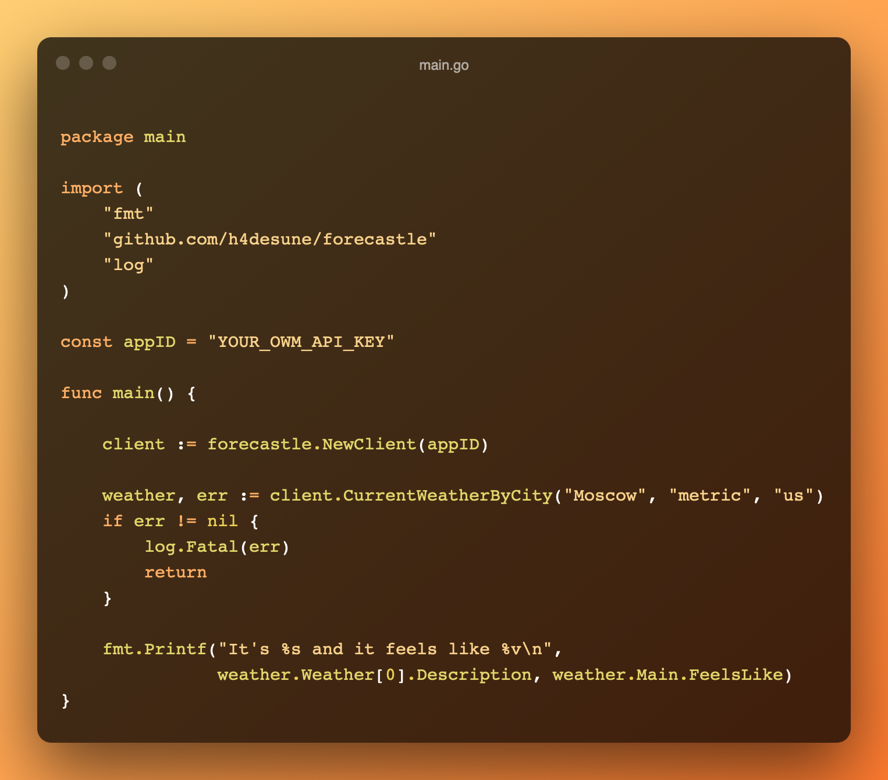

<h1 align="center">Forecastle</h1>
<div align="center"><p>🌧🏯🌥</p></div>
<div align="center"><strong>A simple golang SDK for</strong></div>
<div align="center"><code>OpenWeather API</code> to help you</div>
<div align="center">implement weather forecasts in your apps</div>
<div align="center">with the speed of light ⚡️</div>
<br>

<div align="center">

</div>
<br>
<div align="center">
<a href="https://github.com/h4desune/forecastle">

</a>
</div>

## Table of Contents

- [Documentation]()
- [See Examples]()

## Documentation
All documentation can be accessed through the [repo wiki](https://github.com/h4desune/forecastle/wiki).

## See Examples
All Examples can be accessed through [this folder]().

Here is a quick one for overview:

```shell
main.go                  ⎯ ⠀❐⠀⤬
```
```go
package main

import (
    "fmt"
    "github.com/h4desune/forecastle"
    "log"
)

const appID = "YOUR_OWM_API_KEY"

func main() {

    client := forecastle.NewClient(appID)

    weather, err := client.CurrentWeatherByCity("Moscow", "metric", "us")
    if err != nil {
        log.Fatal(err)
        return
    }

    fmt.Printf("It is %s and it feels like %v\n", weather.Weather[0].Description, weather.Main.FeelsLike)
}
```
```shell
~ go run main.go

It is overcast clouds and it feels like 30.71
```
